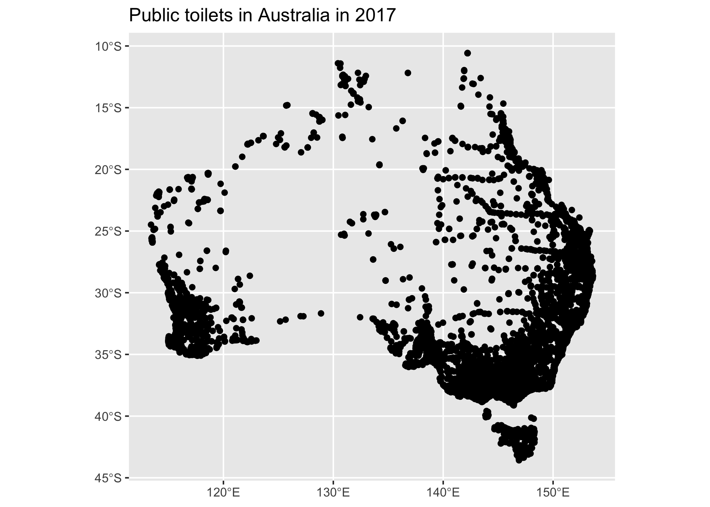

<!-- README.md is generated from README.Rmd. Please edit that file -->

# aurinapi

<!-- badges: start -->

[](https://github.com/asiripanich/aurinapi/actions)
<!-- badges: end -->

The goal of aurinapi is to provide an easy way for R users to download
[AURIN](https://aurin.org.au/) datasets using their
[API](https://aurin.org.au/resources/aurin-apis/aurin-open-api-and-r/).

## Installation

You can install the released version of `aurinapi` from
[GitHub](https://github.com/asiripanich/aurinapi) with:

``` r
install.packages("remotes")
remotes::install_github("asiripanich/aurinapi")
```

## Example

Let’s recreate this [AURIN API AND
R](https://aurin.org.au/resources/aurin-apis/aurin-open-api-and-r/)
example using `aurinapi`.

``` r
library(aurinapi)

if (FALSE) {
  # add_to_renviron = TRUE, so you won't need to run this step again on current machine.
  setup_authentication("your-username", password = "your-password", add_to_renviron = T)  
}

# download this public toilet dataset.
public_toilets_open_api_id = "aurin:datasource-au_govt_dss-UoM_AURIN_national_public_toilets_2017"
public_toilets = aurinapi::fetch_aurin(open_api_id = public_toilets_open_api_id)
#> Reading layer `output' from data source `/private/var/folders/0d/9srpj_750lxbkfs2_8nwkcpw0000gn/T/RtmpeF3jRX/output.geojson' using driver `GeoJSON'
#> Simple feature collection with 18789 features and 46 fields
#> geometry type:  POINT
#> dimension:      XY
#> bbox:           xmin: 113.4102 ymin: -43.582 xmax: 153.6263 ymax: -10.5702
#> geographic CRS: GDA94

# let's visualise it using the mapview package
# install it first if you don't have the package.
# install.packages("mapview")
library(ggplot2)
ggplot(public_toilets) +
  geom_sf() +
  labs(title = "Public toilets in Australia in 2017")
```



See [here](https://data.aurin.org.au/group/aurin-api) to find available
datasets.
