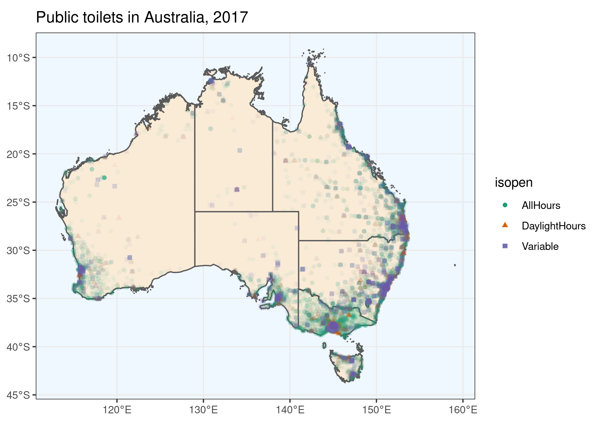

<!-- README.md is generated from README.Rmd. Please edit that file -->

# aurinapi

<!-- badges: start -->


[](https://github.com/asiripanich/aurinapi/actions)

<!-- badges: end -->
<p align="center">

</p>

The goal of `aurinapi` is to provide an easy way for R users to access
**MORE THAN 5000 OPEN DATASETS** on [AURIN](https://aurin.org.au/) using
their
[API](https://aurin.org.au/resources/aurin-apis/aurin-open-api-and-r/).
You can request a **FREE** API key from:

> <https://aurin.org.au/resources/aurin-apis/sign-up/>

**AURIN** is “*Australia’s 🦘 single largest resource for accessing
clean, integrated, spatially enabled and research-ready data on issues
surrounding health and wellbeing, socio-economic metrics,
transportation, and land-use.*”

## Installation

You can install the released version of `aurinapi` from
[GitHub](https://github.com/asiripanich/aurinapi) with:

``` r
install.packages("remotes")
remotes::install_github("asiripanich/aurinapi")
```

This package requires the [sf](https://github.com/r-spatial/sf) package.
Please see the sf package’s [GitHub
page](https://github.com/r-spatial/sf) to install its non R
dependencies.

## Example

Let’s recreate this [AURIN API AND
R](https://aurin.org.au/resources/aurin-apis/aurin-open-api-and-r/)
example using `aurinapi`.

First, you must add your [AURIN API username and
password](https://aurin.org.au/resources/aurin-apis/sign-up/) as an R
environment variable to your `.Renviron` file. `aurinapi` provides
`aur_register()` function to help you with this step. If you choose to
set `add_to_renviron = TRUE` you won’t need to run this step again on
current machine after you restart your R session.

``` r
library(aurinapi)

# add_to_renviron = TRUE, so you won't need to run this step again on current machine.
aur_register(username = "your-username", password = "your-password", add_to_renviron = T)  
```

`aur_browse()` opens [the data catalogue of
AURIN](https://data.aurin.org.au/dataset) on your default browser.

``` r
aur_browse()
```

Identify the ‘**AURIN Open API ID**’ field on the ‘Additional Info’
table of the dataset that you want to download. For example, for this
[public toilet 2017
dataset](https://data.aurin.org.au/dataset/au-govt-dss-national-public-toilets-2017-na)
its ‘**AURIN Open API ID**’ field is
`"aurin:datasource-UQ_ERG-UoM_AURIN_DB_public_toilets"`.

> Note that, some datasets on AURIN may not have ‘**AURIN Open API
> ID**’, meaning that it cannot be downloaded via their API.

Alternatively, you may use `aur_meta` to search datasets without leaving
your R console.

``` r
meta <- aur_meta()
#> ℹ Fetching available datasets...
# print out the first five rows
knitr::kable(head(meta))
```

| aurin\_open\_api\_id                                                                | title                                                           |
|:------------------------------------------------------------------------------------|:----------------------------------------------------------------|
| aurin:datasource-NSW\_Govt\_DPE-UoM\_AURIN\_DB\_nsw\_srlup\_additional\_rural\_2014 | Additional Rural Village Land 18/01/2014 for NSW                |
| aurin:datasource-AU\_Govt\_ABS-UoM\_AURIN\_DB\_GeoLevel\_aus\_2016\_aust            | ABS - ASGS - Country (AUS) 2016                                 |
| aurin:datasource-AU\_Govt\_ABS-UoM\_AURIN\_DB\_GeoLevel\_gccsa\_2011\_aust          | ABS - ASGS - Greater Capital City Statistical Area (GCCSA) 2011 |
| aurin:datasource-AU\_Govt\_ABS-UoM\_AURIN\_DB\_GeoLevel\_gccsa\_2016\_aust          | ABS - ASGS - Greater Capital City Statistical Area (GCCSA) 2016 |
| aurin:datasource-AU\_Govt\_ABS-UoM\_AURIN\_DB\_GeoLevel\_mb\_2016\_aust             | ABS - ASGS - Mesh Block (MB) 2016                               |
| aurin:datasource-AU\_Govt\_ABS-UoM\_AURIN\_DB\_GeoLevel\_mb\_2011\_act              | ABS - ASGS - Mesh Block (MB) ACT 2011                           |

Use `aur_get()` to download the dataset.

``` r
# download this public toilet dataset.
open_api_id <- "aurin:datasource-UQ_ERG-UoM_AURIN_DB_public_toilets"
public_toilets <- aur_get(open_api_id = open_api_id)
#> ℹ Downloading 'aurin:datasource-UQ_ERG-UoM_AURIN_DB_public_toilets'...
#> ✔ Finished!
state_polygons <- aur_get(open_api_id = "aurin:datasource-AU_Govt_ABS-UoM_AURIN_DB_GeoLevel_ste_2016_aust")
#> ℹ Downloading 'aurin:datasource-AU_Govt_ABS-UoM_AURIN_DB_GeoLevel_ste_2016_aust'...
#> ✔ Finished!
state_polygons <- state_polygons[state_polygons$state_code_2016 %in% 1:8, ]
```

Let’s visualise the data using the `ggplot2` package.

``` r
# If you don't have the package you can install it with `install.packages("ggplot2")`.
library(ggplot2)
ggplot(public_toilets) +
  geom_sf(data = state_polygons, fill = "antiquewhite") +
  geom_sf(alpha = 0.05, aes(color = status)) +
  labs(title = "Public toilets in Australia, 2017") +
  scale_color_brewer(palette = "Dark2") +
  theme_bw() +
  guides(colour = guide_legend(override.aes = list(alpha = 1))) +
  theme(panel.background = element_rect(fill = "aliceblue"))
```



See [here](https://data.aurin.org.au/group/aurin-api) to find available
datasets.

## Advanced example

Download multiple datasets in parallel.

Setup the workers.

``` r
library(furrr)
library(future)
future::plan(future::multiprocess, workers = 2)
```

Get AURIN Open API ids of the datasets with ‘toilet’ in their titles.

``` r
knitr::kable(meta[grepl("toilet", meta$title, ignore.case = T), ])
```

|      | aurin\_open\_api\_id                                                           | title                                                  |
|:-----|:-------------------------------------------------------------------------------|:-------------------------------------------------------|
| 1405 | aurin:datasource-AU\_Govt\_DSS-UoM\_AURIN\_national\_public\_toilets\_2017     | DSS - National Public Toilets (Point) 2017             |
| 1465 | aurin:datasource-AU\_Govt\_Doh-UoM\_AURIN\_DB\_national\_toilet\_map\_2018\_06 | Department of Health - National Toilet Map - June 2018 |
| 2773 | aurin:datasource-UQ\_ERG-UoM\_AURIN\_DB\_public\_toilets                       | Public Toilets 2004-2014 for Australia                 |

Get all the datasets in parallel.

``` r
toilet_datasets_ids <- meta$aurin_open_api_id[grepl("toilet", meta$title, ignore.case = T)]
data_lst <- furrr::future_map(toilet_datasets_ids, aur_get)
```
